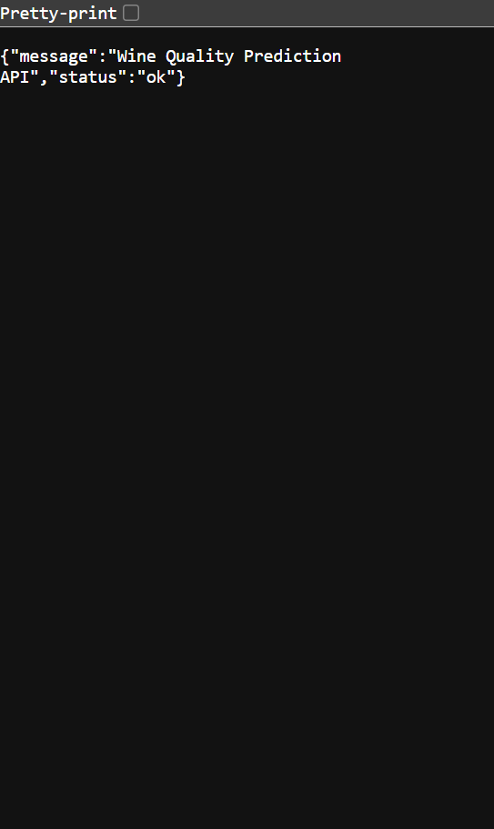
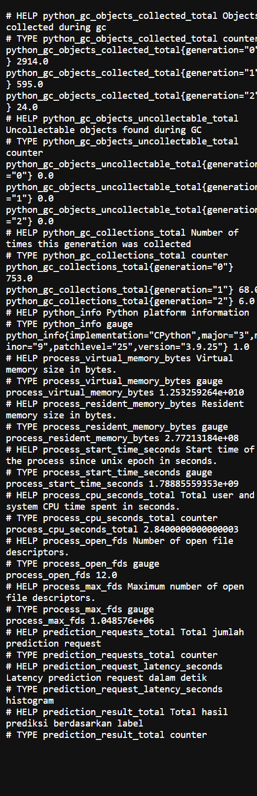

# Submission 1: Wine Quality Classification
Nama: Ridho Rezky Anwar

Username dicoding: ridhorezkyanwar

| | Deskripsi |
| ----------- | ----------- |
| Dataset | [Wine Quality Dataset](https://archive.ics.uci.edu/ml/datasets/wine+quality) dari UCI Machine Learning Repository. Dataset terdiri dari 6.497 data wine merah dan putih dengan 11 fitur kimiawi serta label `quality`. |
| Masalah | Menentukan apakah kualitas sebuah wine termasuk `good` atau `bad` berdasarkan komposisi kimiawinya, sehingga penilaian kualitas dapat dilakukan secara otomatis. |
| Solusi machine learning | Membuat model klasifikasi biner menggunakan TensorFlow untuk memprediksi kualitas wine. Pipeline TFX digunakan untuk preprocessing, training, tuning, evaluasi, dan penyimpanan model yang memenuhi threshold. |
| Metode pengolahan | Semua 11 fitur numerik dinormalisasi menggunakan z-score dengan `tft.scale_to_z_score`. Label diubah menjadi biner: `quality >= 6` menjadi `good (1)` dan `quality < 6` menjadi `bad (0)`. |
| Arsitektur model | Input 11 fitur, Dense(64, relu), Dropout(0.3), Dense(32, relu), Dropout(0.3), dan Dense(1, sigmoid). Hyperparameter dituning menggunakan RandomSearch. |
| Metrik evaluasi | Binary Accuracy dengan threshold keberhasilan minimal 0.70 dan AUC (Area Under the Curve). |
| Performa model | Model dievaluasi oleh komponen Evaluator TFX dan hanya di-push ke serving directory apabila Binary Accuracy memenuhi threshold minimal 0.70. |
| Opsi deployment | Model disajikan melalui Flask API yang dikemas menggunakan Docker dan dideploy pada Railway dengan Gunicorn. |
| Web app | [Wine Quality Prediction API](https://wine-quality-mlops-production.up.railway.app/) |
| Monitoring | Model serving menyediakan endpoint `/metrics` menggunakan Prometheus client untuk memantau jumlah request, latency prediksi, dan distribusi hasil `good`/`bad`. Monitoring lokal dapat dijalankan dengan Prometheus dan Grafana melalui `docker-compose.yml`. |

---

## Bukti Deployment

- Screenshot deployment (Railway) disimpan pada file: 
- Web App URL: https://wine-quality-mlops-production.up.railway.app/

> Catatan: Screenshot deployment disediakan sesuai permintaan reviewer dengan nama file: `ridhorezkyanwar-deployment.png`.

---

## Bukti Monitoring

- Screenshot monitoring (Prometheus / metrics) disimpan pada file: 

> Catatan: Karena lingkungan lokal tidak menjalankan Docker pada runner ini, screenshot monitoring diambil dari endpoint `/metrics` yang tersedia pada deployment Railway. Jika reviewer menginginkan Grafana dashboard secara spesifik, mohon beri tahu — langkah untuk membuat dan menangkap Grafana dashboard:
>
> 1. Jalankan layanan monitoring lokal: `docker-compose up -d` (docker dibutuhkan)
> 2. Akses Grafana di http://localhost:3000 (admin/admin)
> 3. Import atau buat dashboard lalu ambil screenshot bernama `ridhorezkyanwar-monitoring.png`.

---

## Instruksi Verifikasi (Untuk Reviewer)

1. Buka Web App: https://wine-quality-mlops-production.up.railway.app/ — seharusnya menampilkan JSON status API.
2. Endpoint metrics: https://wine-quality-mlops-production.up.railway.app/metrics — berisi metrik Prometheus termasuk `prediction_requests_total`, `prediction_request_latency_seconds`, dan `prediction_result_total`.
3. Lihat file dalam repository untuk bukti screenshot:
   - `ridhorezkyanwar-deployment.png`
   - `ridhorezkyanwar-monitoring.png`

---

## Struktur Proyek (singkat)

```
ProyekPengembangandanPengoperasianSistemMachineLearning/
├── modules/ (transform, trainer, tuner)
├── monitoring/ (Prometheus config + Dockerfile)
├── serving_model/ (model yang di-push)
├── app.py (Flask serving)
├── Dockerfile (app)
├── docker-compose.yml (prometheus + grafana)
└── README.md (dokumentasi ini)
```

---

## Cara Menjalankan (singkat)

1. Setup environment dan install dependencies:

```bash
python -m venv venv
venv\Scripts\activate
pip install -r requirements.txt
```

2. Jalankan Flask app:

```bash
python app.py
```

3. (Opsional) Jalankan monitoring lokal dengan Docker:

```bash
docker-compose up -d
```
